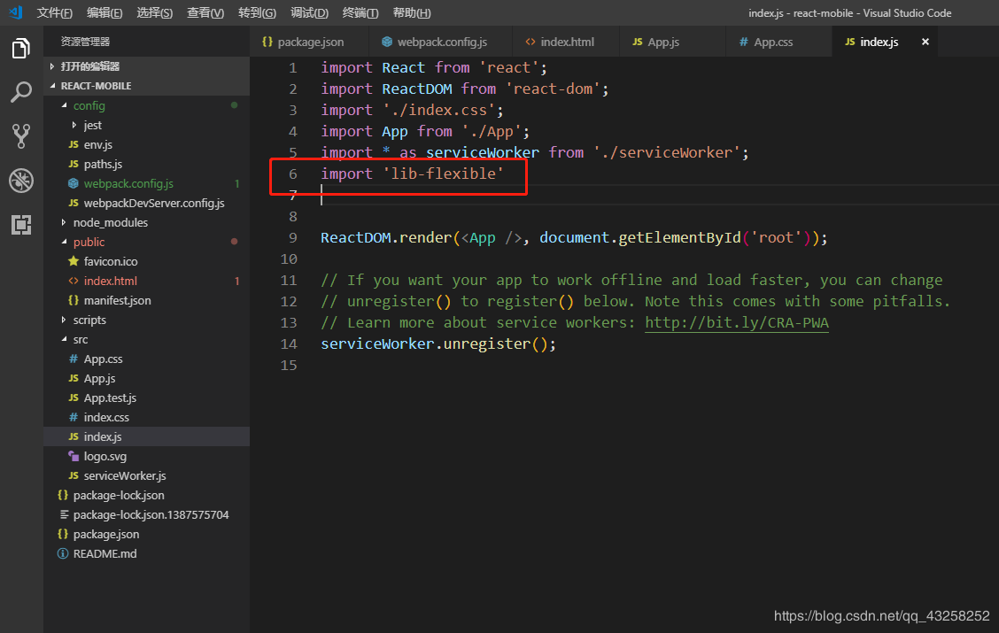
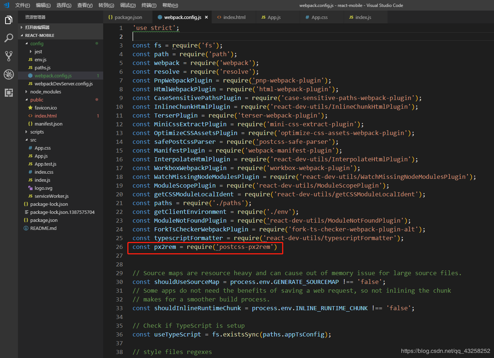
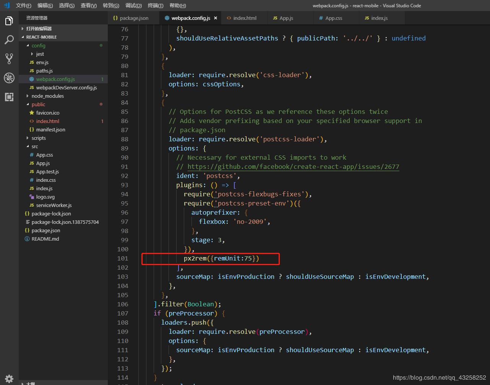
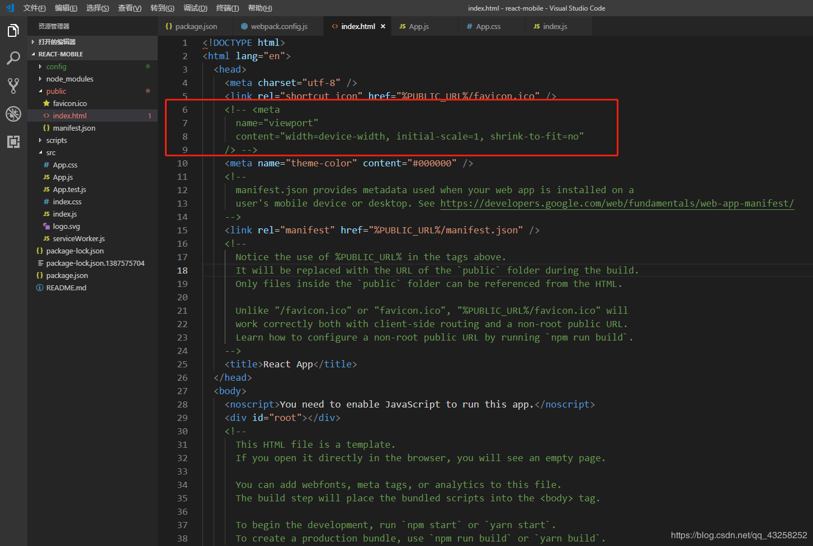

# 基于react-app配置移动端自适应—淘宝弹性布局方案lib-flexible和postcss-px2rem实践（750px设计稿）

## 第一步：

    安装 lib-flexible，postcss-px2rem
    
    npm i lib-flexible --save

    npm i postcss-px2rem --save

## 第二步：

    引入 lib-flexible

    在项目入口文件 index.js 里 引入 lib-flexible
    import 'lib-flexible'

## 第三步：

    在 config/webpack.config.js 文件里 做如下修改

    const px2rem = require('postcss-px2rem')

    px2rem({ remUnit: 75 })

    // px2rem({ remUnit: 75 }) 的意思就是1rem = 75px 这个是根据750px设计稿来的，如果是620 的就写 62

## 第四步：

    在  public/index.html   文件里把下面的这段代码注释掉

## 第五步：

    修改配置后需要重启，然后我们在组件中写单位直接写 px，设计稿量多少就可以写多少了，舒服多了。

# 地址:
[地址](https://blog.csdn.net/qq_43258252/article/details/87867560)
